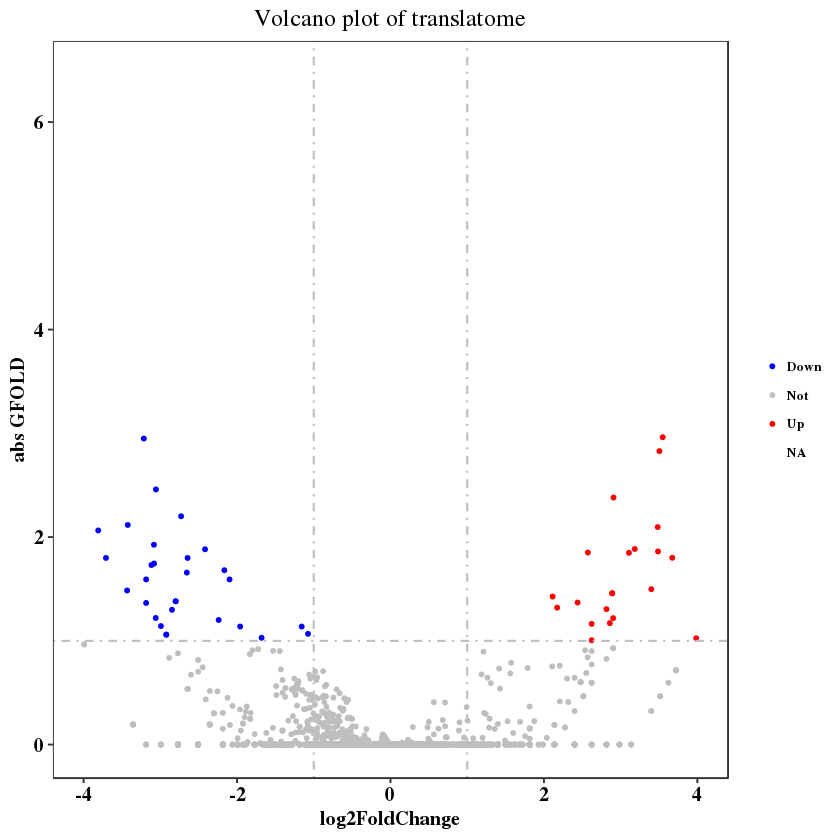
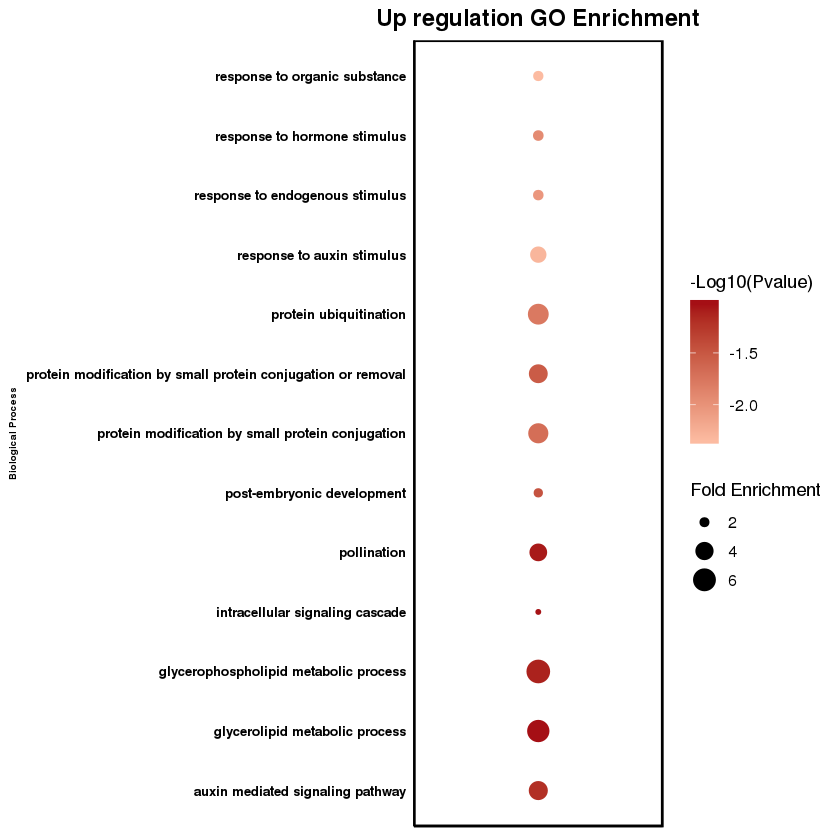
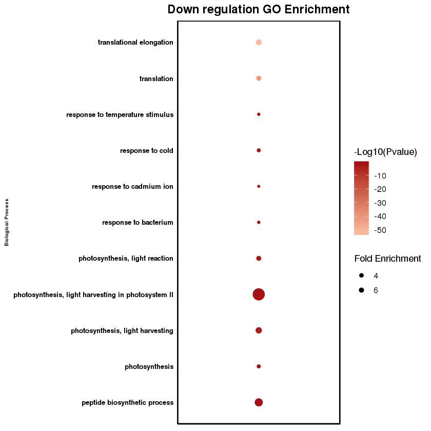

# sl

## Differential translation process in wounding and SL.
**Volcano plot.**

**GO plot. Up regulation plot, down regulation plot.**

## sORF in SL.

**sORF(small peptide) in SL.**
>	78 uORF in d14.  
>	1405 dORF in d14.  
	
**sORF:**

	     51 Annotated
	   1400 Downstream
	    256 Truncated
	     28 Unanno
	     77 Upstream

Genes with uORF.
42 genes and with 78 transcripts have uORFs.  

| ID        | Gene Name                                                                                       | Species              | GOTERM_BP_DIRECT                                                                                                                                                                                                                                                                                                                                                                                                                          |
|-----------|-------------------------------------------------------------------------------------------------|----------------------|-------------------------------------------------------------------------------------------------------------------------------------------------------------------------------------------------------------------------------------------------------------------------------------------------------------------------------------------------------------------------------------------------------------------------------------------|
| AT5G64400 | CHCH domain protein(AT5G64400)                                                                  | Arabidopsis thaliana | GO:0007005~mitochondrion organization,                                                                                                                                                                                                                                                                                                                                                                                                    |
| AT3G55630 | DHFS-FPGS homolog D(DFD)                                                                        | Arabidopsis thaliana | GO:0006730~one-carbon metabolic process,GO:0046901~tetrahydrofolylpolyglutamate biosynthetic process,                                                                                                                                                                                                                                                                                                                                     |
| AT4G02680 | ETO1-like 1(EOL1)                                                                               | Arabidopsis thaliana | GO:0009873~ethylene-activated signaling pathway,GO:0010364~regulation of ethylene biosynthetic process,GO:0016567~protein ubiquitination,                                                                                                                                                                                                                                                                                                 |
| AT3G26430 | GDSL-like Lipase/Acylhydrolase superfamily protein(AT3G26430)                                   | Arabidopsis thaliana | GO:0016042~lipid catabolic process,                                                                                                                                                                                                                                                                                                                                                                                                       |
| AT1G52150 | Homeobox-leucine zipper family protein / lipid-binding START domain-containing protein(ATHB-15) | Arabidopsis thaliana | GO:0006351~transcription, DNA-templated,GO:0006355~regulation of transcription, DNA-templated,GO:0009855~determination of bilateral symmetry,GO:0009965~leaf morphogenesis,GO:0010014~meristem initiation,GO:0010073~meristem maintenance,GO:0010075~regulation of meristem growth,GO:0010087~phloem or xylem histogenesis,GO:0030154~cell differentiation,GO:0048263~determination of dorsal identity,GO:0080060~integument development, |
| AT4G13040 | Integrase-type DNA-binding superfamily protein(AT4G13040)                                       | Arabidopsis thaliana | GO:0006351~transcription, DNA-templated,GO:0006355~regulation of transcription, DNA-templated,GO:0007275~multicellular organism development,GO:0009873~ethylene-activated signaling pathway,GO:0010337~regulation of salicylic acid metabolic process,GO:1900426~positive regulation of defense response to bacterium,                                                                                                                    |
| AT4G24740 | LAMMER-type protein kinase AFC2(FC2)                                                            | Arabidopsis thaliana | GO:0006397~mRNA processing,GO:0046777~protein autophosphorylation,                                                                                                                                                                                                                                                                                                                                                                        |
| AT4G13560 | Late embryogenesis abundant protein (LEA) family protein(UNE15)                                 | Arabidopsis thaliana | GO:0009567~double fertilization forming a zygote and endosperm,GO:0009793~embryo development ending in seed dormancy,                                                                                                                                                                                                                                                                                                                     |
| AT1G10920 | NB-ARC domain-containing disease resistance protein(LOV1)                                       | Arabidopsis thaliana | GO:0002238~response to molecule of fungal origin,GO:0006952~defense response,GO:0050832~defense response to fungus,                                                                                                                                                                                                                                                                                                                       |
| AT1G60800 | NSP-interacting kinase 3(NIK3)                                                                  | Arabidopsis thaliana | GO:0006468~protein phosphorylation,GO:0006952~defense response,GO:0016032~viral process,                                                                                                                                                                                                                                                                                                                                                  |
| AT1G27940 | P-glycoprotein 13(ABCB13)                                                                       | Arabidopsis thaliana | GO:0010315~auxin efflux,GO:0010540~basipetal auxin transport,GO:0010541~acropetal auxin transport,GO:0055085~transmembrane transport,                                                                                                                                                                                                                                                                                                     |
| AT5G14880 | Potassium transporter family protein(AT5G14880)                                                 | Arabidopsis thaliana | GO:0006813~potassium ion transport,GO:0071805~potassium ion transmembrane transport,                                                                                                                                                                                                                                                                                                                                                      |
| AT1G63700 | Protein kinase superfamily protein(YDA)                                                         | Arabidopsis thaliana | GO:0009793~embryo development ending in seed dormancy,GO:0010098~suspensor development,GO:0010103~stomatal complex morphogenesis,GO:0010229~inflorescence development,GO:0040008~regulation of growth,                                                                                                                                                                                                                                    |
| AT1G58350 | Putative serine esterase family protein(ZW18)                                                   | Arabidopsis thaliana | GO:0044255~cellular lipid metabolic process,                                                                                                                                                                                                                                                                                                                                                                                              |
| AT3G53780 | RHOMBOID-like protein 4(RBL4)                                                                   | Arabidopsis thaliana | GO:0016485~protein processing,                                                                                                                                                                                                                                                                                                                                                                                                            |
| AT2G01620 | RNI-like superfamily protein(MEE11)                                                             | Arabidopsis thaliana | GO:0009793~embryo development ending in seed dormancy,GO:0016567~protein ubiquitination,                                                                                                                                                                                                                                                                                                                                                  |
| AT2G07725 | Ribosomal L5P family protein(AT2G07725)                                                         | Arabidopsis thaliana | GO:0006412~translation,                                                                                                                                                                                                                                                                                                                                                                                                                   |
| AT1G61430 | S-locus lectin protein kinase family protein(AT1G61430)                                         | Arabidopsis thaliana | GO:0006468~protein phosphorylation,GO:0045087~innate immune response,GO:0048544~recognition of pollen,                                                                                                                                                                                                                                                                                                                                    |
| AT5G53430 | SET domain group 29(SDG29)                                                                      | Arabidopsis thaliana | GO:0006355~regulation of transcription, DNA-templated,GO:0009294~DNA mediated transformation,                                                                                                                                                                                                                                                                                                                                             |
| AT5G63650 | SNF1-related protein kinase 2.5(SNRK2.5)                                                        | Arabidopsis thaliana | GO:0006468~protein phosphorylation,GO:0006970~response to osmotic stress,GO:0009651~response to salt stress,GO:0035556~intracellular signal transduction,                                                                                                                                                                                                                                                                                 |
| AT3G23150 | Signal transduction histidine kinase, hybrid-type, ethylene sensor(ETR2)                        | Arabidopsis thaliana | GO:0009873~ethylene-activated signaling pathway,GO:0010105~negative regulation of ethylene-activated signaling pathway,                                                                                                                                                                                                                                                                                                                   |
| AT3G10530 | Transducin/WD40 repeat-like superfamily protein(AT3G10530)                                      | Arabidopsis thaliana | GO:0000462~maturation of SSU-rRNA from tricistronic rRNA transcript (SSU-rRNA, 5.8S rRNA, LSU-rRNA),                                                                                                                                                                                                                                                                                                                                      |
| AT5G42320 | Zn-dependent exopeptidases superfamily protein(AT5G42320)                                       | Arabidopsis thaliana | GO:0006508~proteolysis,                                                                                                                                                                                                                                                                                                                                                                                                                   |
| AT1G27480 | alpha/beta-Hydrolases superfamily protein(AT1G27480)                                            | Arabidopsis thaliana | GO:0006629~lipid metabolic process,                                                                                                                                                                                                                                                                                                                                                                                                       |
| AT1G77920 | bZIP transcription factor family protein(TGA7)                                                  | Arabidopsis thaliana | GO:0006351~transcription, DNA-templated,GO:0006355~regulation of transcription, DNA-templated,GO:0042742~defense response to bacterium,                                                                                                                                                                                                                                                                                                   |
| AT4G38230 | calcium-dependent protein kinase 26(CPK26)                                                      | Arabidopsis thaliana | GO:0006468~protein phosphorylation,GO:0009738~abscisic acid-activated signaling pathway,GO:0018105~peptidyl-serine phosphorylation,GO:0035556~intracellular signal transduction,GO:0046777~protein autophosphorylation,                                                                                                                                                                                                                   |
| AT3G58790 | galacturonosyltransferase 15(GAUT15)                                                            | Arabidopsis thaliana | GO:0016051~carbohydrate biosynthetic process,GO:0045489~pectin biosynthetic process,GO:0071555~cell wall organization,                                                                                                                                                                                                                                                                                                                    |
| AT3G51480 | glutamate receptor 3.6(GLR3.6)                                                                  | Arabidopsis thaliana | GO:0006816~calcium ion transport,GO:0006874~cellular calcium ion homeostasis,GO:0009416~response to light stimulus,GO:0009611~response to wounding,GO:0009864~induced systemic resistance, jasmonic acid mediated signaling pathway,GO:0019722~calcium-mediated signaling,GO:0071230~cellular response to amino acid stimulus,                                                                                                            |
| AT4G20130 | plastid transcriptionally active 14(PTAC14)                                                     | Arabidopsis thaliana | GO:0006355~regulation of transcription, DNA-templated,GO:0009416~response to light stimulus,GO:0009658~chloroplast organization,GO:0010027~thylakoid membrane organization,GO:0018026~peptidyl-lysine monomethylation,GO:0042793~transcription from plastid promoter,                                                                                                                                                                     |
